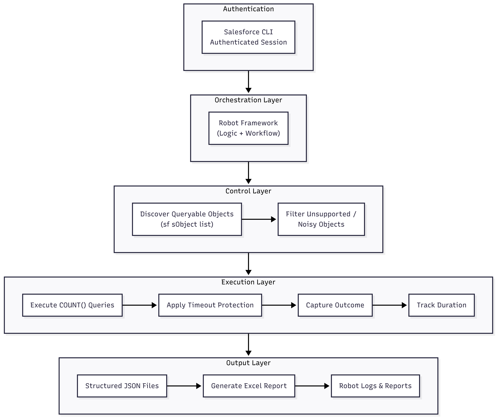

# Architecture

## Overview

The **Salesforce Objects Scanner Tool** is a Robot Framework–based automation solution designed to analyze Salesforce org data footprint by retrieving record counts across all queryable objects.

The architecture focuses on **safe execution, structured outputs, and scalability**, making it suitable for large Salesforce environments with hundreds to thousands of objects.

The solution combines:
- Salesforce CLI (`sf`) for metadata discovery and query execution
- Robot Framework for orchestration and control flow
- Process-based execution with timeout safeguards
- Structured JSON outputs and Excel reporting for analysis

---

## Why This Architecture

Salesforce does not provide a single unified way to retrieve record counts across all objects efficiently.

Key challenges:
- Large number of objects (standard + custom + tooling)
- Some objects require filters or are not queryable
- Long-running queries can block execution

This architecture addresses these challenges by:

- Using Salesforce CLI for consistent and authenticated query execution  
- Applying timeout protection to prevent long-running failures  
- Classifying skipped objects for transparency  
- Generating structured outputs for downstream analysis  

---

## High-Level Architecture

### Architecture Breakdown

The system follows a layered execution model:

<p align="center">
  
</p>

---

### Control Layer (Salesforce CLI)

- Uses `sf sobject list --json` to discover queryable objects  
- Executes `SELECT COUNT()` queries via CLI  
- Handles authentication using Salesforce CLI session  

---

### Orchestration Layer (Robot Framework)

- Coordinates full scan workflow  
- Applies filtering logic for unsupported objects  
- Handles retry-safe, deterministic execution  
- Manages logging and reporting  

---

### Execution Layer

- Executes queries per object  
- Applies per-query timeout protection  
- Tracks execution duration  
- Ensures controlled and predictable runtime  

---

### Output Layer

- JSON artifacts:
  - `data.json`
  - `tooling.json`
  - `skipped.json`
  - `durations.json`
- Excel report:
  - `SF_Objects_<timestamp>.xlsx`

---

## Repository Structure

```
salesforce-objects-scanner/
├── output/                                     # Generated JSON + Excel reports
├── results/                                    # Robot execution logs
│   ├── log.html
│   ├── output.xml
│   └── report.html
├── src/
│   └── robot/
│       ├── libraries/
│       │   └── ExcelWriter.py
│       ├── orchestrator/
│       │   └── scan.robot
│       └── resources/
│           └── keywords.robot                  # Core logic  
├── .gitignore
├── CODE_OF_CONDUCT.md
├── CONTRIBUTING.md
├── README.md
├── requirements.txt
└── SECURITY.md

```


---

## Folder Responsibilities

- **docs/**        – Architecture and design documentation  
- **src/robot/**   – Core test suites and libraries  
- **output/**      – Generated JSON and Excel reports  
- **results/**     – Robot Framework logs and reports  
- **ci/**          – CI test suites  

---

## Execution Model

### Authentication

- Managed via Salesforce CLI (`sf org login web`)  
- No credentials stored in code  
- Session-based authentication reused across commands  

---

### Object Discovery

- Retrieve all objects via CLI  
- Filter:
  - Non-queryable objects  
  - Unsupported types  
  - Known noisy patterns  

---

### Query Execution Flow

1. Discover objects  
2. Filter unsupported objects  
3. Execute `SELECT COUNT()` per object  
4. Apply timeout control  
5. Capture success or skip reason  
6. Track execution duration  
7. Persist results  

---

## Failure and Handling Model

- Objects that fail are classified into:
  - `COUNT_NOT_SUPPORTED`
  - `REQUIRES_WHERE`
  - `INVALID_TYPE`
- No retry amplification (predictable execution)
- Failures are recorded in `skipped.json`
- Execution continues without interruption  

---

## Security Architecture

- Authentication delegated to Salesforce CLI  
- No credentials stored in repository  
- Uses existing authenticated sessions  
- Sensitive files excluded via `.gitignore`  

---

## Runtime vs Source Separation

| Category        | Location     | Notes                          |
|----------------|-------------|--------------------------------|
| Source code    | `src/robot/`| Version-controlled             |
| Outputs        | `output/`   | Generated at runtime           |
| Reports        | `results/`  | Execution logs                 |
| CI tests       | `ci/`       | Smoke test automation          |
| Documentation  | `docs/`     | Architecture & design          |

---

## Design Principles

- Deterministic execution (no retries)
- Timeout-controlled processing
- Clear separation of concerns
- Structured and traceable outputs
- Scalable for large orgs
- CLI-based authentication (no secrets in code)
- CI/CD compatible and headless execution ready

---

## Scalability Considerations

- Handles hundreds to thousands of objects  
- Sequential execution ensures stability  
- Future-ready for parallel execution (Pabot)  
- Performance depends on:
  - Org size  
  - Network latency  
  - Query response time  

---

## Extensibility

The framework can be extended with:

- Additional filters for object classification  
- Parallel execution support (Pabot)  
- Custom analytics on output data  
- Integration with dashboards or databases  

---

## Observability and Monitoring

- Robot Framework HTML reports (`log.html`, `report.html`)  
- JSON outputs for structured analysis  
- Execution duration tracking per object  
- Clear success vs skip visibility  

---

## Deployment Model

- Local developer environments  
- CI/CD pipelines (GitHub Actions, Jenkins)  
- Headless execution environments  
- Containerized environments (future scope)  

---

**Author:** Bhimeswara Vamsi Punnam  
**Role:** Lead Software Development Engineer in Test (SDET)
