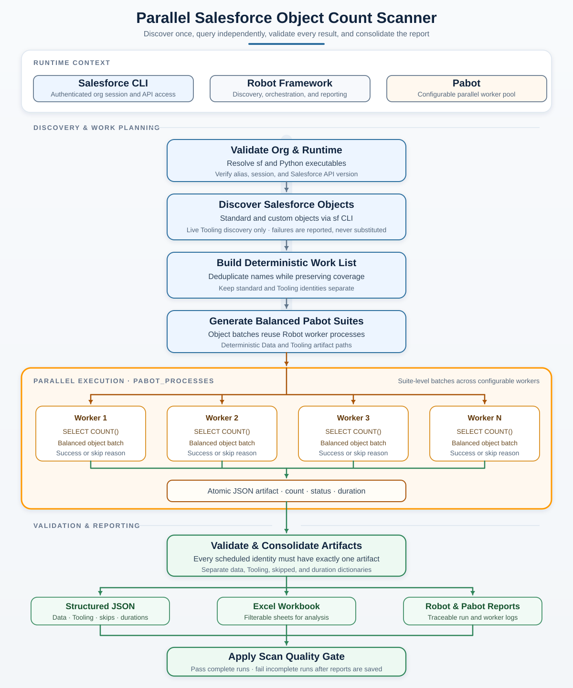

# Architecture

The scanner is a Robot Framework suite that uses Salesforce CLI for discovery
and SOQL queries. Pabot supplies the worker processes. Two small Python libraries
handle CLI output that is awkward to parse in Robot and create the Excel file.

## Scan flow

  

1. `scan.robot` checks the org alias and Salesforce CLI session.
2. Salesforce CLI returns the data-object list. If Tooling is enabled, the
   scanner also reads the Tooling API's queryable object list.
3. The object names are deduplicated and spread across generated Robot suites.
4. Pabot runs those suites with the configured number of processes. Each object
   gets its own `SELECT COUNT()` query and timeout.
5. A worker writes one JSON artifact for each object it finishes.
6. The parent suite checks the artifacts, builds the final JSON files and Excel
   workbook, and then decides whether the run should pass or fail.

Tooling discovery has no built-in fallback list. If it fails, data-object work
continues, `TOOLING::DISCOVERY` is added to the skipped results, and the run fails
after the reports are written. Set `INCLUDE_TOOLING:false` when Tooling objects
are not part of the scan.

## Parallel work

`PABOT_PROCESSES` sets the number of processes. The scanner creates up to
`PABOT_PROCESSES * PABOT_SHARDS_PER_PROCESS` suites and assigns objects to them
round-robin. Splitting the work into more suites than processes helps when a few
objects take much longer than the rest.

A Pabot process handles a batch of objects rather than starting a new Robot
process for every query. This keeps process startup under control while still
allowing work to be shared between workers.

## Main files

| File                                              | Role                                                  |
|---------------------------------------------------|-------------------------------------------------------|
| `src/robot/orchestrator/scan.robot`               | Command-line entry point                              |
| `src/robot/resources/keywords.robot`              | Top-level scan sequence                               |
| `src/robot/resources/configuration.resource`      | Defaults and command-line value checks                |
| `src/robot/resources/salesforce.resource`         | Discovery, queries, retries, and error classification |
| `src/robot/resources/parallel_execution.resource` | Worker-suite generation and artifact checks           |
| `src/robot/resources/reporting.resource`          | Output directories, JSON files, and workbook call     |
| `src/robot/libraries/SfUtils.py`                  | CLI parsing, executable lookup, and error redaction   |
| `src/robot/libraries/ExcelWriter.py`              | Excel workbook generation                             |

## Worker artifacts

Every run has its own `pabot/artifacts/` directory. Artifact names include the
API type and object name, so a data object and Tooling object with the same name
do not overwrite one another.

Workers write to a temporary file first and then move it to the final `.json`
path. Before reporting, the parent checks that:

- The number of artifacts matches the number of scheduled objects
- Every expected object has exactly one artifact
- Required fields are present and have the right types
- Successful counts are non-negative integers

The workbook is not created when these checks fail, because the worker output is
incomplete or malformed.

## Errors, skips, and retries

Salesforce has objects that are discoverable but cannot answer an unfiltered
`COUNT()` query. Known cases are saved as expected skips and do not fail the
run. Permissions, expired sessions, timeouts, invalid responses, and unknown
errors are treated as operational problems.

`EXTERNAL_OBJECT_EXCEPTION`, `REQUEST_LIMIT_EXCEEDED`, and `UNKNOWN_EXCEPTION`
are retried by default. The delay doubles after each failed attempt. Timeouts and
known unsupported-query cases are not retried.

Reports are written before the final operational-error check, so there is still
something to inspect when a run fails. Setting
`FAIL_ON_OPERATIONAL_ERRORS:false` suppresses that final failure. It does not
make skipped objects complete or safe to ignore.

## Authentication and output

The scanner uses the Salesforce CLI session for the supplied org alias. It does
not store a username, password, or token. Each scan runs with the permissions of
that Salesforce user.

The final workbook and JSON files are stored under
`output/Run_<date-time>_<id>/`. Pabot details stay in that run directory, while
Robot's top-level log and report go to the directory passed with `-d`.

See [Usage](usage.md) for the output layout and [Security](../SECURITY.md) for
handling credentials and scan results.

---

[Back to README](../README.md) | [Troubleshooting](troubleshooting.md)
